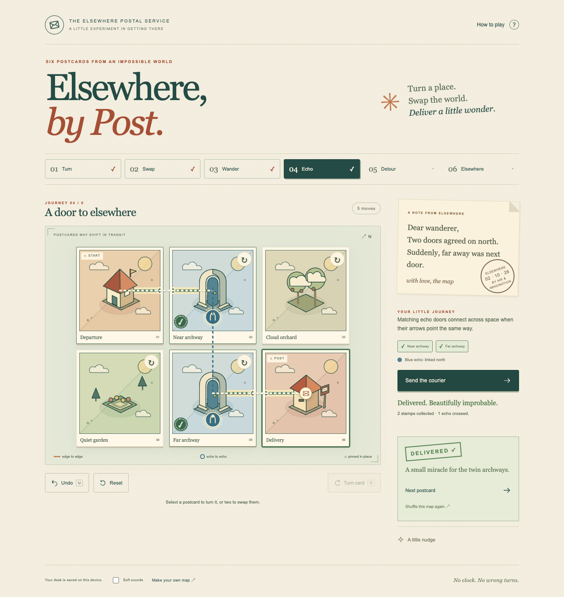

# Elsewhere, by Post

A tiny impossible postcard map. Turn a place, swap the world, deliver a little wonder.

The prototype includes a local mapmaker for designing, checking and playing your own six-postcard worlds.

Six handcrafted journeys teach quarter-turn roads, swapping illustrated landmarks, collecting postage stamps, and compass-sensitive **echo doors**. Matching doors connect distant postcards when their arrows agree. Each pair can be crossed once per journey. Departure and delivery stay pinned.



## Play locally

Requires Node.js 22 or later. There are **no runtime dependencies** and no credentials.

```sh
git clone https://github.com/aranlucas/elsewhere-by-post.git
cd elsewhere-by-post
npm install -g portless@0.15.7
npm run dev
```

Open **https://elsewhere-by-post.localhost**. The local server binds only to loopback by default. Closing the server ends the session; the next visit restores your desk.

```sh
npm run build
npm start
```

This serves the deployable `dist/` folder on the same local port. Use a local HTTP server rather than opening `index.html` with `file://`, because ES modules and offline caching require an HTTP origin.

### Development URL with Portless

The normal `npm run dev` command uses
[Portless](https://github.com/vercel-labs/portless/tree/v0.15.7) for a stable local URL.
Install its CLI once with **Node.js 24 or newer** (within this project's supported
range), then run:

```sh
npm install -g portless@0.15.7
npm run dev
```

Open **https://elsewhere-by-post.localhost** with the default proxy settings.
Portless starts its shared proxy automatically. Its first HTTPS run creates and
trusts a local certificate authority and may prompt for administrator privileges
to bind port 443 or update local hostname entries. Start it from an interactive
terminal and review those prompts. `portless doctor` diagnoses local setup issues.

The existing Node server reads the assigned `PORT` and loopback `HOST` from
Portless, so it does not compete for its usual fixed port.

Linked Git worktrees receive a branch-name prefix, such as
`https://fix-ui.elsewhere-by-post.localhost`; use the URL Portless prints.

Browser storage and offline caches belong to each origin. Existing data at a
numbered localhost URL stays there; use the app's export/import flow when available
to move data to the named URL.

## Controls

| Action | Pointer / touch | Keyboard |
| --- | --- | --- |
| Select | Tap a postcard | Tab / arrow keys, then Enter |
| Turn | ↻ on a card, or select and use Turn card | R; Shift+R turns back |
| Swap | Tap two postcards, or drag one onto another | Select two cards with Enter |
| Undo | Undo | U |
| Send / stop courier | Send / Stop | P |
| Clear selection | Tap selected card | Escape |
| Reset | Reset | Focus the Reset button and Enter |

The courier takes a shortest legal journey that visits every stamp and uses each required echo. Failed attempts show a reachable partial journey and name what is missing. There is no clock or failure penalty. Nudges offer an authored clue and optional one-card assistance; they remain undoable. After delivery, Shuffle offers another recoverable arrangement of that map.

## Make your own little world

Open **https://elsewhere-by-post.localhost/maker.html**, or use “Make your own map” in the game footer. Select one of six postcards and choose its landmark, roads, orientation, stamp and echo. Departure and delivery remain pinned. Author a solved arrangement first; the route check uses the same engine as the game and proves that a legal itinerary collects all stamps and crosses each echo once.

Shuffle & play saves a playable custom journey on this device and adds a “Yours” postcard to the game. Its nudge can always restore the authored witness. Some forgiving maps may still be connected after shuffling; validation promises solvability, not difficulty or uniqueness. Publishing a new shuffle gives that custom journey fresh progress while preserving the six built-in journeys.

The editor saves a local draft and supports undo. Export downloads a compact JSON map; import accepts six known landmarks and at most 32 KiB of data, rejects malformed shapes and preserves the current map on failure. Names render as literal text. No custom scripts, asset URLs, credentials, game progress or other personal data are exported. An invalid current layout can be kept as a local draft, but play/export require a validated route. If browser storage is blocked, a valid map can still be exported.

Both the editor and custom play work offline after the first successful cached visit.

## Verification

```sh
npm test             # Node's built-in deterministic engine/storage tests
npm run build        # Static asset build, no installation required
npm ci               # Only needed for browser tests; installs official Playwright
npm run test:browser  # Uses an installed Google Chrome, isolated test profiles, one worker
PLAY_DIST=1 npm run test:browser # Verifies the deployable build on local port 4187
```

Browser tests use Chrome through Playwright's `channel: 'chrome'`. They never use your personal Chrome profile. Install Chrome from its official vendor if it is absent, or change the config to an installed Playwright Chromium. The suite includes axe WCAG A/AA checks. See [QA.md](docs/QA.md) for actual results and limits.

GitHub CI installs official Playwright Chromium on an isolated Linux runner and runs the same suite using `PLAY_BROWSER_CHANNEL=chromium`. It checks rules, the static build, browser playthroughs, offline behavior and accessibility; its workflow does not deploy the game.

## Small, local, portable

- Native HTML buttons, CSS, original inline SVG art, plain JavaScript ES modules.
- A pure route engine is separate from rendering, storage and sound.
- Optional quiet synthesized sound; off initially. Reduced-motion preference is respected.
- Progress, board state and undo history stay in this origin's `localStorage`. No accounts, analytics, personal data, network APIs or external AI calls.
- A service worker caches all game assets after the first successful visit. Reloads and play then work offline. Clearing site storage removes local progress and cached files. In browsers that block storage, a session remains playable and a notice explains that saving is unavailable.
- Build output is a static site. Asset revisions change the offline cache key automatically.

## Deployment compatibility

Nothing has been provisioned or publicly released.

**Cloudflare:** `npm run build`, then serve `dist/` using Workers Static Assets (`wrangler.jsonc`) or Pages (build command `npm run build`, output `dist`). `_headers` supplies a same-origin content security policy. No runtime Worker is needed. Configuration follows [Cloudflare's official Static Assets documentation](https://developers.cloudflare.com/workers/static-assets/). Private access controls should be configured before any future hosted release.

**Railway:** the `Dockerfile` uses Node's built-in static server, binds to `0.0.0.0`, and respects Railway's supplied `PORT`. `railway.json` points to that Dockerfile and uses `/` as its health check. Docker and provider deployment have not been executed here.

## Source map

| File | Purpose |
| --- | --- |
| `src/engine.js` | Reciprocal edge graph, echo alignment, legal stamp-aware journey search, hints, shuffles |
| `src/levels.js` | Six authored levels with independently checked witness arrangements |
| `src/app.js` | Accessible actions, touch and keyboard input, courier animation, progression |
| `src/art.js` | Original vector landmarks and icons |
| `src/storage.js` | Versioned save validation and failure recovery |
| `src/custom-map.js` | Bounded custom-map schema, witness validation, draft/publication storage and shuffle identity |
| `src/maker.js` | Local editing, route feedback and JSON import/export |
| `public/sw.js` | Offline cache |
| `tests/` | Deterministic tests and browser playthroughs |

See [DECISIONS.md](docs/DECISIONS.md) for precedents, scope choices and possible next experiments.
